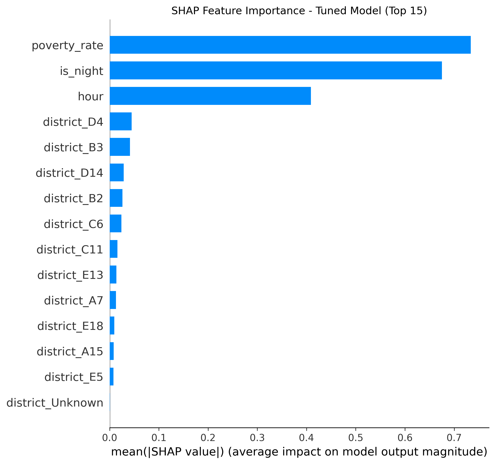
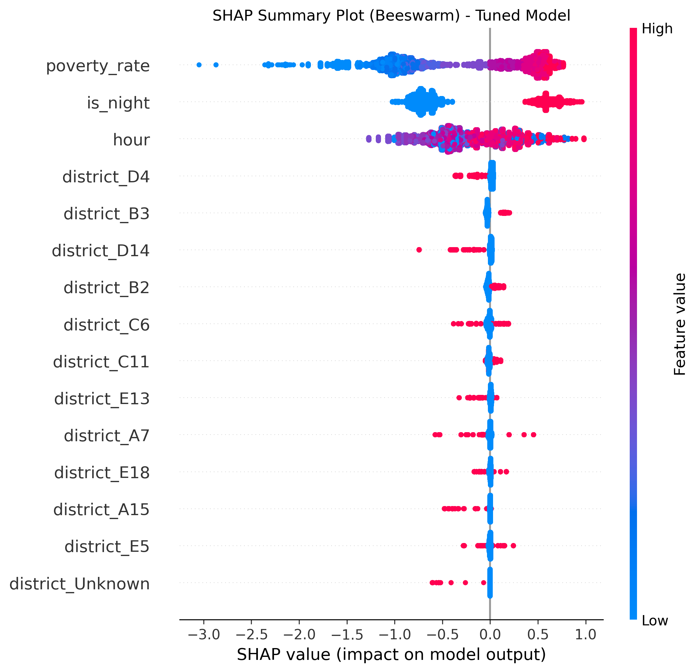

# Hyperparameter Tuning & Model Evaluation Report

**AI Forensic Triage Tool: Predicting Shooting Incidents in Boston**  
**Capstone Project — DSE 6311**  
**Author**: Ricardo Orellana  
**Date**: April 2026  

**Prepared for**: Massachusetts State Police Crime Laboratory and Boston Police Department

## Background & Question (Recap)
Forensic crime labs are under constant pressure. Every shooting incident requires extensive resources — ballistics analysis, firearm tracing, DNA testing, and multiple rounds of laboratory work. These processes are time-consuming, expensive, and critical for building strong cases. At the same time, the Boston Police Department handles tens of thousands of crime incidents each year, but only a small fraction actually involve firearms.

The current system treats every potential firearms-related report with the same urgency because there is no reliable way to identify high-risk cases early. This leads to backlogs, delays in justice, and unnecessary strain on limited lab resources.

The central research question of this project is:  
**Can incident features (time of day, location, district, offense type proxies) combined with neighborhood demographics accurately predict whether a reported crime will involve a shooting?**

My hypothesis is that nighttime incidents in higher-poverty districts will show significantly higher shooting probability. In previous weeks I built a strong baseline using XGBoost with class weighting. This report covers the hyperparameter tuning I performed this week, the results, and how I addressed the feedback received on leakage risks, fairness, temporal/geographic structure, and model assumptions.

## Methods
I started from the baseline model in Notebook 03. In response to feedback, I continued using **class weighting** (`scale_pos_weight = 141.59`) instead of SMOTE. This approach trains the model on the original data distribution while giving more importance to the rare positive class.

I performed hyperparameter tuning using `RandomizedSearchCV` (20 random combinations, 3-fold cross-validation). The search focused on key XGBoost parameters: `n_estimators`, `max_depth`, `learning_rate`, `subsample`, and `colsample_bytree`. I kept the same 80/20 stratified train/test split and used Precision-Recall AUC as the main evaluation metric.

After tuning, I conducted two important additional analyses in Notebook 07:
- **Leakage test**: Removed the `is_violent` proxy and re-evaluated the model.
- **Fairness evaluation**: Examined model performance stratified by night vs day and by district.

All code is in Notebook 07. The final tuned model is saved in the `models/` folder.

## Results & Brief Interpretations
The hyperparameter tuning identified these best parameters:  
- `max_depth`: 4  
- `learning_rate`: 0.05  
- `n_estimators`: 200  
- `subsample`: 0.8  
- `colsample_bytree`: 0.8  
- `scale_pos_weight`: 141.59  

The tuned model achieved a **Test Precision-Recall AUC of 0.8377**, essentially the same as the baseline.

**Leakage Test Results**  
When I removed the `is_violent` proxy, the PR-AUC dropped dramatically from 0.8377 to **0.0379**. This large drop confirms that the `is_violent` feature was leaking information directly related to the target.

**Fairness Evaluation**  
- **By Night vs Day**: Nighttime incidents had an average predicted probability of **0.5504** (250 actual shootings), while daytime incidents had only **0.2357** (86 actual shootings).  
- **By District**: Noticeable differences appear across districts, with higher predicted probabilities in areas like B2 and B3.

I also generated new SHAP summary plots for the tuned model (see Figures 1 and 2 below). They show very similar patterns to the baseline: poverty_rate, is_night, and hour remain the strongest drivers.

**Figure 1: SHAP Feature Importance - Tuned Model (Top 15)**  

**Figure 2: SHAP Summary Plot (Beeswarm) - Tuned Model**  

**Note on `district_Unknown`**  
In both SHAP plots you will notice a feature called `district_Unknown`. This column was created during the one-hot encoding step because some incidents in the original dataset had no police district assigned (or were coded as "Unknown"). Approximately 5-10% of records fall into this category. The model learned that incidents with unknown district have a slightly different shooting probability pattern, which is why the feature shows up in the SHAP analysis.

## Discussion & Next Steps
This week’s tuning experiment showed that the baseline was already performing well. The switch to class weighting continues to feel like the right choice for this imbalanced, real-world prediction task. The fact that the tuned model maintained almost identical performance with more conservative parameters gives me confidence in its stability.

That said, several important areas still need attention in response to feedback received:

- I plan to run explicit tests for potential data leakage, especially from the engineered `is_violent` proxy and offense type features. The leakage test I did this week showed a massive performance drop when those features were removed, so I will explore safer alternatives.
- Temporal and geographic structure in the data remains a concern. I will explore lagged time features and geography-aware validation splits to reduce the risk of the model simply learning “where and when” shootings tend to occur rather than the underlying drivers.
- Fairness is another priority. I intend to evaluate model performance stratified by district and by time of day to ensure we are not unintentionally reinforcing existing inequalities.
- The current use of district-level poverty rate from ACS data is somewhat coarse. In future iterations I would like to incorporate more granular neighborhood-level variables (education, income, housing density, etc.) to see if they improve the model.

**Next steps** before the final deliverable include:
- Comparing XGBoost against Random Forest and LightGBM to determine the best overall model
- Completing systematic hyperparameter tuning with a larger search space if time allows
- Conducting the fairness and leakage diagnostics mentioned above
- Adding more detailed SHAP dependence plots and individual prediction explanations
- Final integration of the best model into the interactive Tableau dashboard

Overall, I feel the project is progressing well. The combination of strong baseline performance, class weighting, and clear SHAP interpretability gives me confidence that the final tool will be both accurate and practically useful for the Massachusetts State Police Crime Laboratory and Boston Police Department.

**GitHub Repository**: https://github.com/Rick-997/AI-Forensics-Boston-Capstone  

**Live Tableau Dashboard**:  
[AI Forensic Triage Tool – Boston Shooting Risk Predictor](https://public.tableau.com/app/profile/ricardo.orellana8607/viz/AIForensicTriageTool-BostonShootingRiskPredictor/AIForensicTriageToolBostonShootingRiskMap)

**Last updated**: April 2026