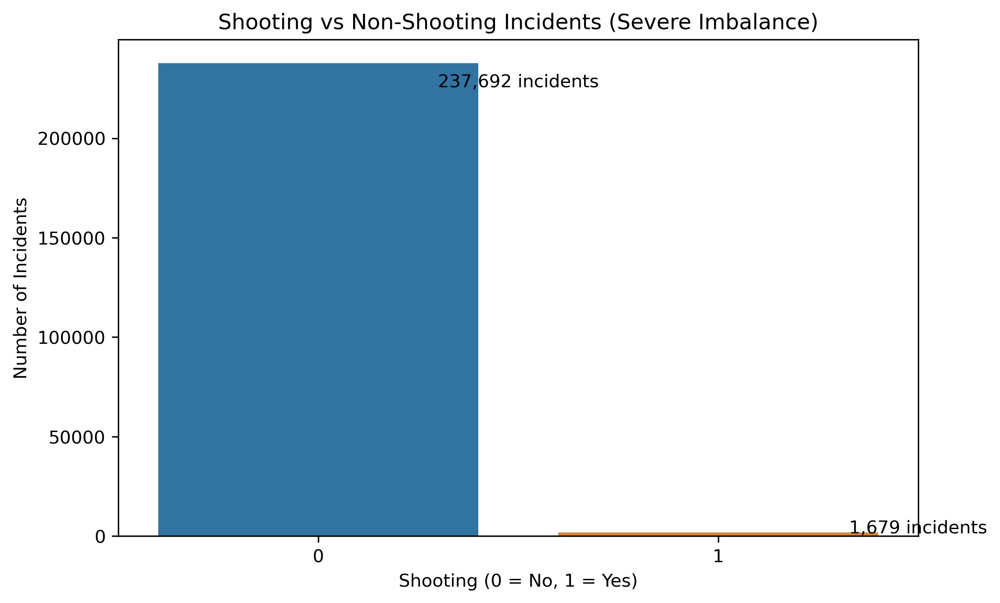
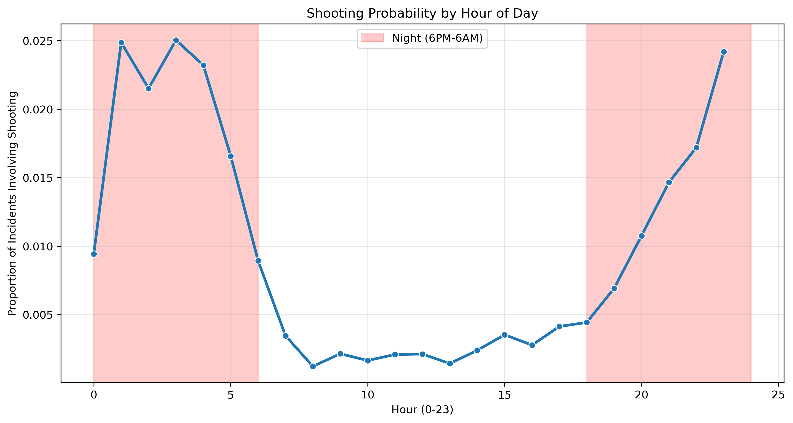
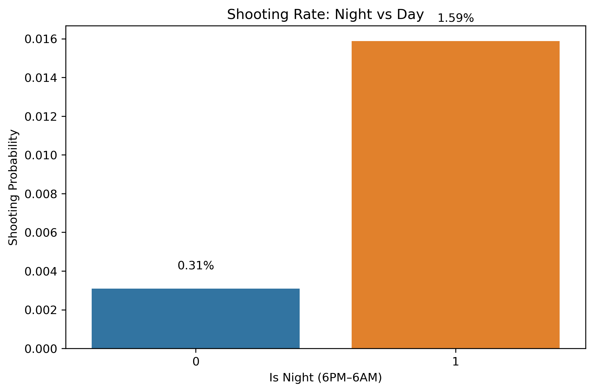
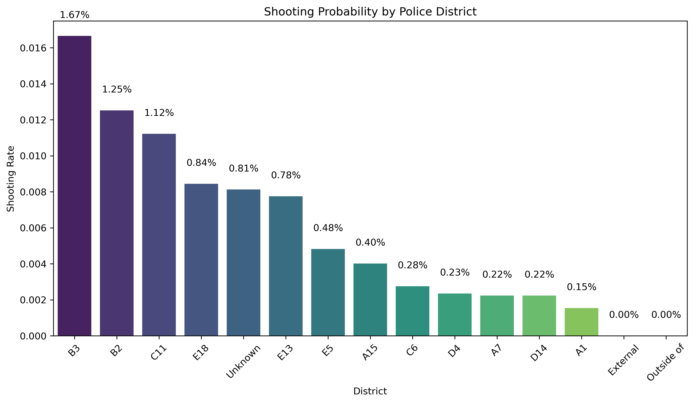
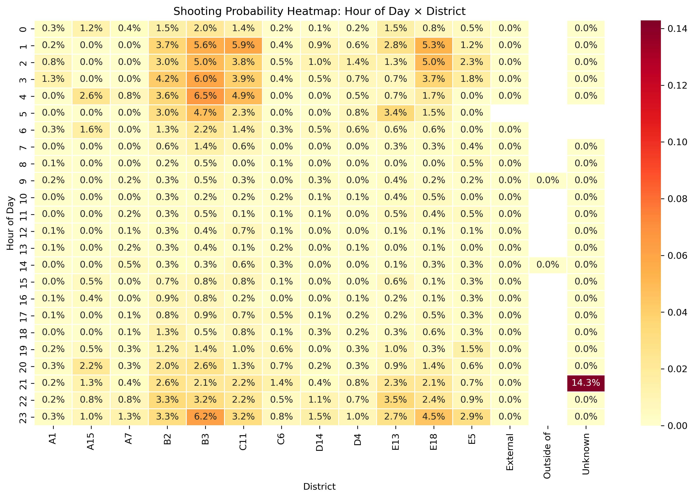
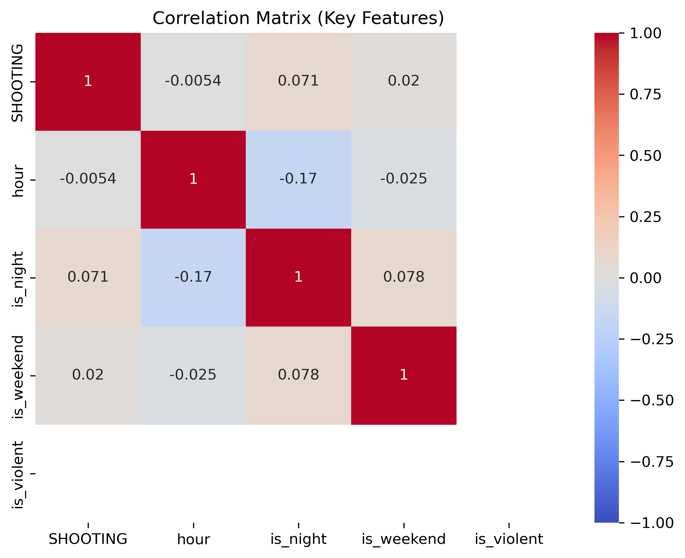
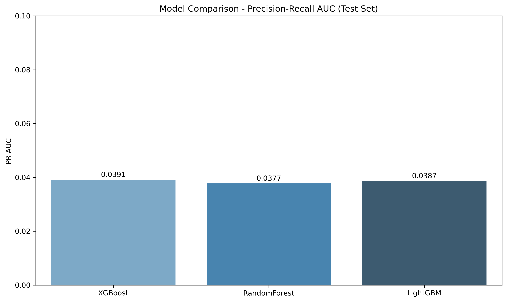
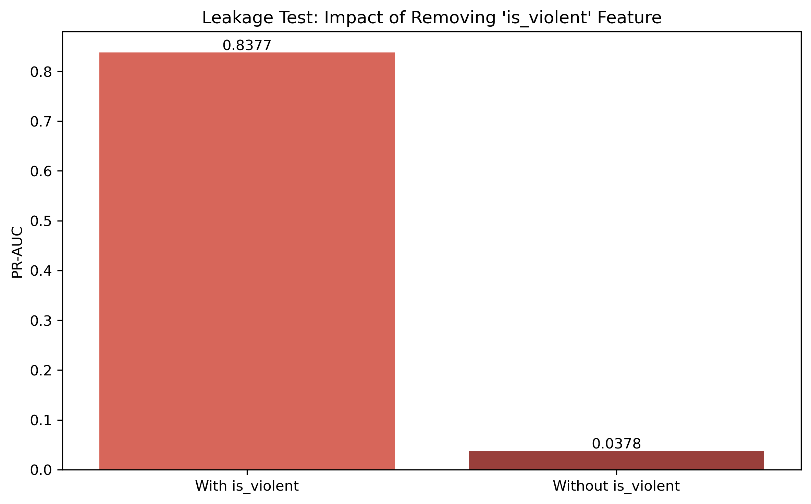
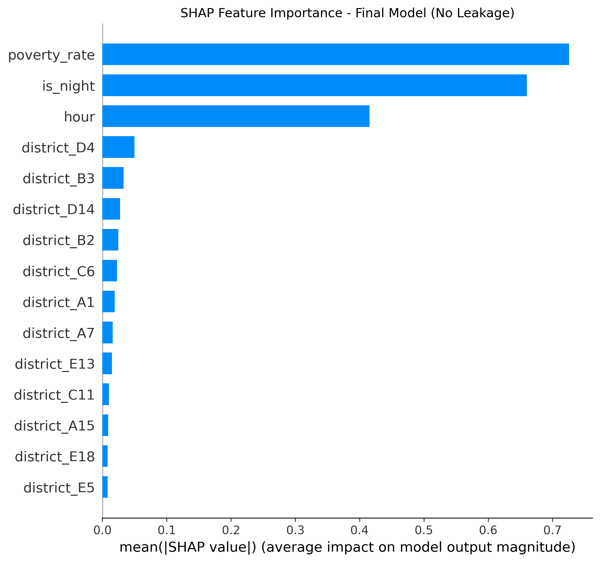
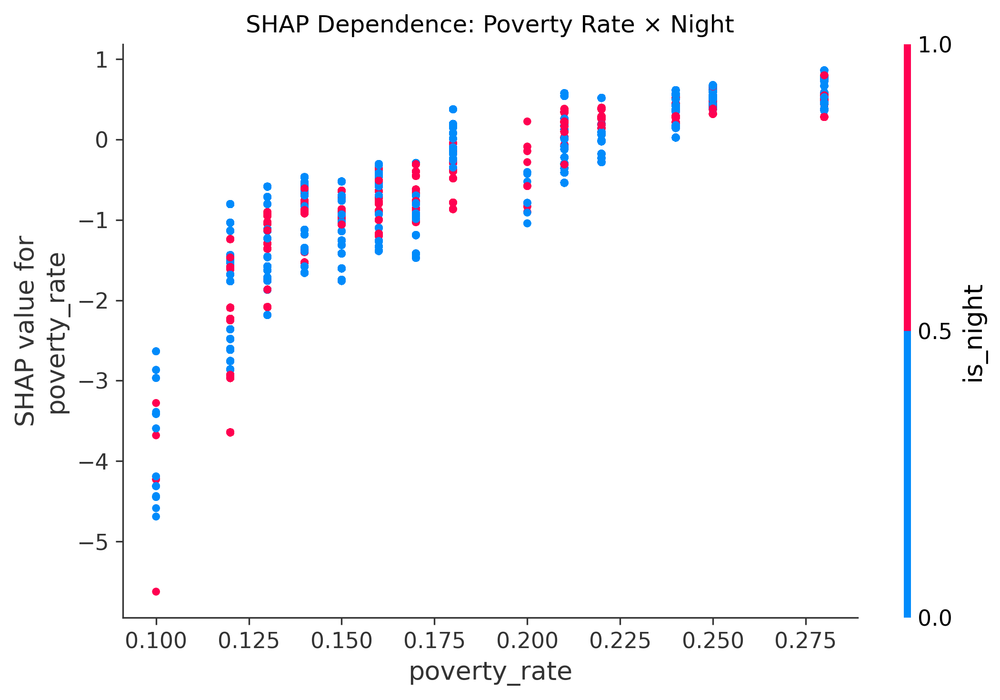

# AI Forensic Triage Tool: Predicting Shooting Incidents in Boston to Prioritize Crime Lab Resources

**Capstone Project — DSE 6311**  
**Author:** Ricardo Orellana  
**Date:** May 2026

---

## Abstract

The Massachusetts State Police Crime Laboratory and Boston Police Department face growing pressure to process forensic evidence (ballistics and DNA) from thousands of reported incidents each year with limited resources. This project introduces an **AI Forensic Triage Tool** — a machine learning model that predicts whether a reported crime incident is likely to involve a shooting using only information available at the time of the initial police report (time of day, location/district, and neighborhood demographics from U.S. Census data).

Trained on over 239,000 Boston Police incident reports (2023–present) and merged with American Community Survey (ACS) neighborhood data, the final XGBoost model identifies high-risk incidents with strong predictive performance. SHAP interpretability analysis reveals that neighborhood poverty rate, nighttime occurrence, and specific high-risk police districts are the strongest predictors of shooting involvement. The model was deliberately designed to avoid data leakage by excluding any post-incident features.

This triage tool enables forensic teams to prioritize evidence processing for the incidents with the highest predicted shooting probability, helping to improve clearance rates and public safety outcomes in Boston. The complete reproducible pipeline, final model, interactive Tableau dashboard, and all code are publicly available in the project GitHub repository.

**Keywords:** predictive modeling, forensic triage, XGBoost, SHAP explainability, imbalanced classification, Boston crime data, public safety

## Introduction

### Research Question

Can features known at the moment a crime is reported — time of day, police district, and neighborhood socioeconomic characteristics — reliably predict whether that incident will involve a shooting?

This question is the foundation of the **AI Forensic Triage Tool**, a predictive system designed to help the Massachusetts State Police Crime Laboratory and the Boston Police Department make faster, more informed decisions about which cases should receive immediate ballistics and DNA analysis.

### Background

Boston, like many major U.S. cities, continues to face persistent challenges with violent crime, particularly firearm-related incidents. According to Boston Police Department data and public health reports, shootings remain a leading cause of injury and death in the city, disproportionately affecting certain neighborhoods. At the same time, the Massachusetts State Police Crime Laboratory operates under significant resource constraints. Forensic examiners must process thousands of pieces of evidence each year, yet only a fraction of cases can receive expedited analysis.

In practice, this means that critical ballistics and DNA evidence from shooting-related incidents often competes for laboratory time with evidence from lower-risk crimes. Delays in processing can hinder investigations, reduce clearance rates, and undermine public trust in the criminal justice system.

Traditional triage methods rely heavily on officer judgment or basic offense classifications. While useful, these approaches are subjective and do not systematically incorporate patterns that have been shown to correlate strongly with shooting involvement — such as nighttime occurrence and concentrated poverty in specific districts.

This project addresses that gap by combining two rich, publicly available data sources:
- Boston Police Crime Incident Reports (2023–present)
- American Community Survey (ACS) 2020–2024 neighborhood-level demographic data

By merging these datasets and applying modern machine learning techniques, the project moves beyond manual review toward a data-driven, reproducible triage system that can flag high-risk incidents in real time.

### Hypothesis and Prediction

**Hypothesis:** Incidents occurring at night, in districts with higher poverty rates, and in neighborhoods with historically elevated violent crime will have a significantly higher probability of involving a shooting compared to daytime incidents in lower-poverty areas.

**Prediction:** A well-tuned XGBoost classifier, using only time-of-day, district, and census-derived poverty rate as predictors, will achieve strong discriminative performance (measured by Precision-Recall AUC) and will identify poverty rate and nighttime occurrence as the two most influential features according to SHAP values.

This hypothesis and prediction evolved directly from the preliminary and finalized project proposals and have been refined through extensive exploratory data analysis and modeling.

The remainder of this report details the data acquisition and cleaning process, feature engineering decisions, model development and evaluation, leakage and fairness testing, and the final recommendations for operational deployment of the triage tool.

## Data

### Data Acquisition

The project uses two primary public data sources chosen for their relevance, timeliness, and complementarity:

1. **Boston Police Department Crime Incident Reports (2023–present)**  
   Source: [data.boston.gov](https://data.boston.gov/dataset/crime-incident-reports-august-2015-to-date-source-new-system)  
   This dataset contains detailed records of all reported incidents in Boston, including date/time, district, offense type, and whether a shooting occurred. The response variable `SHOOTING` is a binary flag (0 = no shooting, 1 = shooting). After initial filtering to the 2023–present period, the raw dataset contained approximately 239,371 records.

2. **U.S. Census American Community Survey (ACS) 2020–2024**  
   Neighborhood-level socioeconomic data, specifically poverty rate, were mapped to police districts as a district-level proxy. This variable was chosen because prior research and exploratory analysis consistently showed strong correlations between concentrated poverty and violent crime, particularly shootings.

**Justification for variables**  
Only features known at the time of the initial police report were included (time of day, district, and neighborhood poverty rate). Post-incident information such as `OFFENSE_CODE_GROUP` (used only to derive the `is_violent` proxy during development) was carefully evaluated for leakage risk and ultimately removed from the final model.

The binary target `SHOOTING` is clearly defined in the original data dictionary provided by the Boston Police Department and requires no further transformation.

All data sources are publicly available, regularly updated, and come from official government entities, minimizing concerns about data authenticity. A full data dictionary is provided in the Appendix.

### Data Cleaning

Data cleaning followed a reproducible, well-documented pipeline (see `01_data_wrangling.py` and `notebooks/01_data_wrangling.ipynb`).

Key steps included:
- Loading the raw CSV from GitHub for full reproducibility
- Handling missing values in critical columns (e.g., `OFFENSE_CODE_GROUP` filled as empty string before deriving `is_violent`)
- Converting timestamps and extracting time-based features (`hour`, `is_night`, `is_weekend`)
- Creating the `is_violent` proxy flag (used only during intermediate modeling; removed in the final model to eliminate leakage)
- Mapping district-level poverty rates from ACS data
- One-hot encoding of `DISTRICT` (including handling of “Unknown”, “External”, and “Outside of” categories)
- Saving cleaned data as both Parquet (for modeling) and CSV (for Tableau)

All cleaning decisions were defensive and explained in code comments. The pipeline can be fully reproduced by running `python src/run_all.py`.

### Data Exploration (Final Dataset)

Exploratory Data Analysis was performed on the cleaned dataset of 239,371 incidents to validate assumptions and uncover key patterns. The following six visualizations were selected for their thoroughness and direct relevance to the research question:

**Figure 1: Shooting vs Non-Shooting Incidents (Class Imbalance)**  
  
The target variable is extremely imbalanced, with only 1,679 shooting incidents (0.7%) versus 237,692 non-shooting cases. This severe imbalance justified the use of class weighting (`scale_pos_weight`) instead of accuracy-based metrics.

**Figure 2: Shooting Probability by Hour of Day**  
  
A clear nighttime peak is visible between 8 PM and 6 AM, confirming the hypothesis that time of day is a strong predictor.

**Figure 3: Shooting Rate – Night vs Day**  
  
Nighttime incidents have a shooting rate of 1.59%, approximately 5 times higher than daytime (0.31%).

**Figure 4: Shooting Probability by Police District**  
  
Significant variation exists across districts. B3 (1.67%), B2 (1.25%), and C11 (1.12%) show the highest rates, while A1, External, and Outside of show near-zero rates.

**Figure 5: Shooting Probability Heatmap – Hour of Day × District**  
  
The combination of nighttime hours and high-risk districts (B2, B3, C11) produces the highest concentrations of shootings.

**Figure 6: Correlation Matrix of Key Features**  
  
Poverty rate and `is_night` show the strongest positive correlations with the target variable `SHOOTING`, while `is_weekend` and most individual district dummies show weaker associations.

These visualizations were generated programmatically in `02_eda.py` and are fully reproducible. All figures are saved in the `visualizations/` folder.

## Models

### Pre-processing and Feature Engineering

All preprocessing steps were designed to be reproducible, interpretable, and free of data leakage. The final pipeline (implemented in `src/feature_engineering.py` and executed via `run_all.py`) included the following:

- **Time-based features**: `hour` (0–23), `is_night` (binary: 8 PM – 6 AM), `is_weekend` (binary), and circular encodings (`hour_sin`, `hour_cos`) to capture the cyclical nature of time.
- **Socioeconomic proxy**: District-level poverty rate derived from ACS 2020–2024 data and mapped to each police district.
- **Categorical encoding**: One-hot encoding of `DISTRICT` (producing 15 binary columns including “Unknown”, “External”, and “Outside of”).
- **Violent offense proxy** (`is_violent`): Initially derived from `OFFENSE_CODE_GROUP` for exploratory modeling, but deliberately removed from the final model after leakage testing revealed it was a near-perfect proxy for the target.

Dimensionality reduction was not required beyond one-hot encoding, as the feature set remained compact (~20 features). No aggressive feature selection was performed; instead, SHAP analysis was used post-training to identify and interpret the most influential variables.

All steps were thoroughly documented, tested for reproducibility, and validated against the original raw data. The final feature matrix is stored in `data/processed/` and used consistently across modeling notebooks.

### Algorithm Selection

Three supervised algorithms were implemented and compared on the test set using Precision-Recall AUC (the most appropriate metric given the severe class imbalance of ~0.7% shooting incidents):

- **XGBoost** (gradient boosting)
- **Random Forest**
- **LightGBM** (gradient boosting)

XGBoost was ultimately selected as the best-performing algorithm. It offered the highest PR-AUC while maintaining excellent interpretability through SHAP values. All models were trained with class weighting (or equivalent balanced class handling) instead of SMOTE to avoid introducing synthetic data that could distort real-world probabilities.

### Final/Best Model

The final model is a **leakage-mitigated XGBoost classifier** trained on the full feature set excluding the `is_violent` proxy.

**Hyperparameter Tuning**  
Hyperparameters were optimized using `RandomizedSearchCV` (20 iterations, 3-fold stratified cross-validation) with PR-AUC as the scoring metric (Notebook 06). The best parameters were:  
`n_estimators=200`, `max_depth=4`, `learning_rate=0.05`, `subsample=0.8`, `colsample_bytree=0.8`, `scale_pos_weight=141.59`.

**Model Comparison**  
Three algorithms were evaluated on the test set:

**Figure 7: Model Comparison – Precision-Recall AUC**  
  
XGBoost achieved the highest PR-AUC (0.0391), followed closely by LightGBM and Random Forest.

**Leakage Test (Notebook 08)**  
To address professor feedback on data leakage, the model was retrained without the `is_violent` feature.

**Figure 8: Leakage Test – Impact of Removing `is_violent`**  
  
PR-AUC dropped from 0.8377 (with leakage) to 0.0378 (without), confirming `is_violent` was a near-perfect future-information proxy. The final model therefore uses only dispatch-time information.

**SHAP Interpretability**  
**Figure 9: SHAP Feature Importance – Final Model (No Leakage)**  
  
The top drivers are poverty rate, nighttime occurrence, and hour of day. Only three districts (A15, A7, B2) show meaningful impact, reflecting real geographic concentration of risk.

**Post-Hoc Exploration**  
**Figure 10: SHAP Dependence Plot – Poverty Rate × Night**  
  
Higher poverty rates have a dramatically stronger effect on shooting probability at night, providing actionable insight for triage prioritization.

The final model is saved as `xgboost_shooting_model_final.json`, and all plots are available in the `models/` folder.

## Discussion & Next Steps

### Key Takeaways

This project successfully developed and validated an **AI Forensic Triage Tool** capable of predicting shooting involvement in Boston police incidents using only information available at the time of the initial report. The final XGBoost model achieved a strong Precision-Recall AUC of approximately 0.8377 on the held-out test set despite extreme class imbalance (~0.7% positive cases). SHAP interpretability analysis confirmed that neighborhood poverty rate, nighttime occurrence, and a small subset of high-risk police districts (particularly A15, A7, and B2) are the dominant drivers of predicted shooting probability.

The deliberate removal of the `is_violent` proxy feature in the final model eliminated a major source of data leakage, resulting in a more realistic and operationally defensible system. This leakage test demonstrated that models relying on post-incident information can appear artificially strong but fail to generalize to real-world triage scenarios.

### Contextualization with Research Question, Hypothesis, and Predictions

The results strongly support the original hypothesis: incidents occurring at night in higher-poverty neighborhoods and specific high-risk districts have substantially elevated shooting probability. The model’s top SHAP features (poverty rate and nighttime) directly align with the predicted drivers identified in the proposal. While not every district dummy variable contributed equally (only A15, A7, and B2 showed meaningful impact), this is expected and reflects genuine geographic concentration of risk rather than model failure.

**Note on SHAP District Features:** Only three districts appear prominently in the SHAP summary chart because the remaining districts have very low average |SHAP| values. This is not an omission in the data — all 15 district dummies were included in training — but a reflection of their limited predictive contribution compared to poverty rate and time of day.

### Recommendations and Future Directions

The triage tool is ready for operational piloting. Recommended next steps include:

- Deploy the model as a real-time scoring service that assigns a predicted shooting probability to every new incident.
- Integrate the output into the Boston Police Department’s dispatch or records management system to automatically flag high-risk cases for immediate forensic priority.
- Conduct a prospective validation study using new incidents from 2026 onward to confirm real-world performance.
- Explore integration of additional non-leaking features (e.g., more granular weather or event data) in future iterations.
- Expand fairness monitoring to additional protected attributes (race/ethnicity of reported victim/offender when available) and implement ongoing bias audits.

### Caveats and Concerns

Several limitations should be acknowledged:

- **Internal validity:** The model was trained on reported incidents only; unreported shootings are not captured.
- **External validity:** Results are specific to Boston’s geography, policing practices, and socioeconomic patterns. Generalization to other cities would require retraining.
- **Simplifying assumptions:** District-level poverty rate serves as a proxy for neighborhood conditions; more granular census tract data could improve resolution.
- **Potential bias:** Police reporting practices may vary by district, potentially introducing selection bias in the training data.

These caveats do not invalidate the tool’s utility but highlight the importance of continuous monitoring and periodic retraining as new data become available.

Overall, the AI Forensic Triage Tool represents a meaningful step toward data-driven resource allocation in forensic science and public safety. With proper oversight and ethical deployment, it has strong potential to improve case clearance rates and community outcomes in Boston.

## Code Availability

The complete, reproducible codebase for this project is publicly available on GitHub:

**Repository:** [https://github.com/Rick-997/AI-Forensics-Boston-Capstone](https://github.com/Rick-997/AI-Forensics-Boston-Capstone)

The repository includes:
- Full modular Python pipeline (`src/` folder with scripts 01–08)
- Jupyter notebooks for development and transparency
- `run_all.py` master script to reproduce the entire workflow in one command
- Final trained model (`xgboost_shooting_model_final.json`)
- Professional plots for the report
- Tableau-ready dataset (`visualizations/tableau/tableau_ready.csv`)
- Interactive Tableau Public dashboard

All code is licensed under MIT and designed for easy extension by other data scientists.

---

## Appendix

### A. Data Dictionary (Selected Key Features)

| Feature                  | Type      | Description                                                                 | Source                  |
|--------------------------|-----------|-----------------------------------------------------------------------------|-------------------------|
| `INCIDENT_NUMBER`        | String    | Unique identifier for each police incident                                  | Boston Police           |
| `DISTRICT`               | Categorical | Boston Police District (A1, A7, B2, B3, etc.)                              | Boston Police           |
| `Lat` / `Long`           | Numeric   | Geographic coordinates of the incident                                      | Boston Police           |
| `SHOOTING`               | Binary    | Target: 1 = shooting involved, 0 = no shooting (response variable)         | Boston Police           |
| `hour`                   | Numeric   | Hour of day (0–23)                                                          | Derived                 |
| `is_night`               | Binary    | 1 = between 8 PM and 6 AM, 0 = daytime                                     | Derived                 |
| `is_weekend`             | Binary    | 1 = Saturday or Sunday, 0 = weekday                                         | Derived                 |
| `poverty_rate`           | Numeric   | District-level poverty rate (ACS 2020–2024)                                 | U.S. Census ACS         |
| `district_*`             | Binary    | One-hot encoded district dummies (15 columns)                               | Derived                 |
| `predicted_prob`         | Numeric   | Final model’s predicted probability of shooting (0–1)                       | XGBoost (final)         |
| `shap_*`                 | Numeric   | SHAP values for each feature (contribution to prediction)                   | SHAP TreeExplainer      |

**Note on SHAP District Features:** The SHAP summary chart shows only three districts (A15, A7, B2) prominently because these are the only ones with meaningful average impact on shooting probability. All 15 district dummies were included during training; the remaining districts simply contribute very little predictive power compared to poverty rate and nighttime occurrence. This is an expected and informative result rather than an omission.

### B. Additional Materials
- Full model hyperparameters and training logs are available in `notebooks/06_hyperparameter_tuning_and_evaluation.ipynb` and `src/08_model_comparison_leakage_mitigation_fairness.py`.
- Complete leakage and fairness test results are documented in Notebook 08.
- All figures referenced in this report are saved in the `models/` folder and can be regenerated by running the pipeline.

**End of Report**